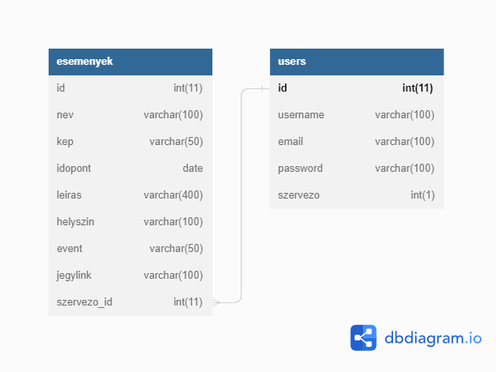
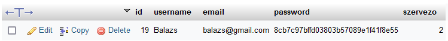
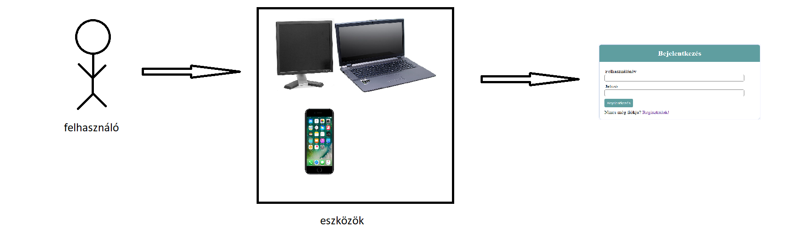
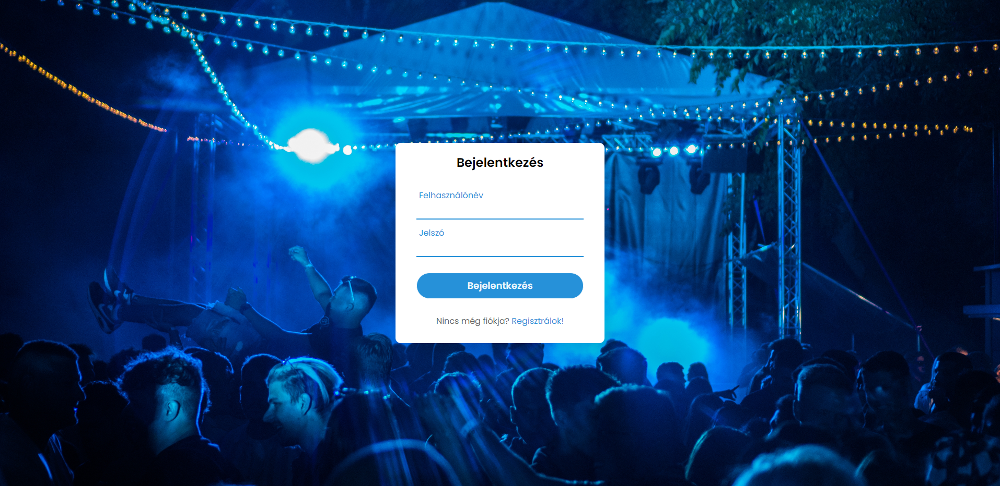

# Szoftverfejlesztési módszertanok
## PartyApp
### Szerzők:
#### Dobos Balázs, Papp Dániel, Szarka Marcell, Varga Szabolcs

### Tartalom

**Követelmények**
    
    1. Rendszerspecifikáció
    
    2. Követelményspecifikáció
    
    3. Funkcionális specifikáció

## Követelmények

### 1. Rendszerspecifikáció

#### Feladat:

Az applikáció a szoftverfejlesztési módszertanok tárgy beadandó projekt munkájaként készül.

A PartyApp egy olyan web alapú alkalmazás amely lehetővé teszi felhasználói számára , hogy szórakozási lehetőségeiket mind kereső, mind szervező oldalról egyszerű módon kiteljesíthessék. Kezdeti fázisban fejlesztés megkönnyítése érdekében Desktop-os felületet támogatja, az alkalmazás későbbiekben viszont Mobil eszközökkel is kompatibilis lesz. A nagy projekt részeként a későbbiekben beolvadó login felület a tárgy követelményei alapján felosztott évi teendők mini projekt részét képezi. Az alkalmazás várható elkészülési ideje 2022. december.

#### Környezet:

__Linux/Windows 10, php, javascript, css, html, MySql__

#### Alkalmazott fejlesztői eszközök:

Microsoft Visual Studio Code, XAMPP, Apache

#### Tervezés:

A projektünket a Trello nevű alkalmazással terveztük, ami átláthatóságot, egyszerűséget biztosít és a csapatban dolgozást lényegesen megkönnyebbíti, valamint a személyre szabott feladatok jól elkülöníthetők, egyértelműen látszik minden csapattag haladása.

#### Megvalósítás menete:

A tervezési folyamatokat követően a fejlesztést verziókezelő segítségével megkezdjük.
 A fejlesztési folyamatokat több ágra osztjuk a fejlesztők között majd az egyes ágak elkészültével mergeljük azokat.
 A fejlesztés előrehaladtával folyamatosan teszteket futtatunk, melyek elősegíti az esetleges hibák felfedezését.
A frontend fejlesztéséhez php, javascript, html és css nyelven történik.
A backend fejlesztéséhez MySQL és php nyelveket használ a fejlesztőcsapat. Az adatbázis kapcsolásának táblájáról kép is található a dokumentációban. Az adatbázis fejlesztése során a fejlesztők a stabilitás mellett a redundancia csökkentést egyik fő céljukként tűzték ki az adatok gyorsabb elérésének érdekében.

#### Adatmodell leírása

A PartyApp miniprojektjének alappilére a fent látható adatbázis, mely bővülni fog. A táblák elemeinek típusát okkal választották a fejlesztők így. Az "esemenyek" tábla  "nev", "leiras", "helyszin", "event", "jegylink",  valamint a "users" tábla "username", "email", "password" sorai szöveges információt fognak tartalmazni, ezért VARCHAR típust kaptak, valamint a zárójelben található szám az emberi gondolkodás szerint logikus maximális méret miatt lett így behatárolva. A "kep" sor egy kép linkjét fogja meghatározni, erre hivatkozunk a megjelnítés során. Az "id" és "szervezo_id" sorok INT értéket kaptak, valamint a két "id" sor auto-increment funkcióval lett ellátva, az egyedi felhasználó és esemény érdekében. Az időpont "date" típust kapott.

A regisztáció alatt a felhasználó kétfajta rangot állíthat be magának, amit az adatbázis eltárol, ezalapján kap felhasználói jogosultságokat a PartyApp használatával kapcsolatban a későbbiekben. A felhasználó és szervező közötti legfőbb különbség az "eseményfeltöltés" funkció lesz, melyet csak a szervező láthat. Regisztrációtól függetlenül tartalmaz egy admin rangot is az app, melyet a fejlesztők és az általuk megbízott személyek kaphatnak. Ezzel a ranggal az app minden funkciója elérhető lesz számukra.

A felhasználók adatbiztonságának érdekében az adatbázis a jelszavak tárolására __MD5 (Message-Digest algorithm 5)__ titkosítását használ, így a regisztrált felhasználók jelszavait az adminok sem láthatják.

A fent látható kép minden tekintetben példa, az esetleges visszafejtés után sem használható ez a példafelhasználó semmire.

### 2. Követelmény specifikáció

####  Jelenlegi helyzet leírása:

A való életben egyszerűbb lehetne a szórakozni vágyó fiatalok számára, vagy a szórakozást biztosító helyek rendezvényszervezői számára egy egyszerű módszer arra, hogy időben, nem a pillanat hevében döntsenek arról ,hová szeretnének menni szórakozni. Napjainkban a számítógép és mobiltelefon használata belekerült a napi rutinunkba, így egyszerűen, az app használatával a felhasználóknak lehetőséget nyújt az app mind szórakozási, mind létrehozási vágyaik teljesítésére. 

####  Vágyálom rendszer leírása: 

Egy weboldal létrehozása, először Desktopra fókuszálva, a későbbiekben mobilon is jól megjeleníthetően. Használata hasonló lesz több népszerű mobilos társkereső app használatához, "jobbra ha tetszik, balra ha nem".

####  Igényelt üzleti folyamatok:

A PartyApp megkönnyíti a keresést és a válogatást egyaránt a rendszerezetlen események között, az app erre nyújt megoldást, rendszerezi a felhasználói számára a kiszemelt lehetőségeket.

#### Jelenlegi üzleti folyamatok:

A mai világban rengeteg szórakozási lehetőség van, de ezekről a közösségi médián tájékozódhatunk nagyrészt, nincsenek összegyűjtve, se fókuszba helyezve érdeklődési kör alapján.

####  Követelménylista:

Az app használatához elegendő kattintani, mint "tag", eseményfeltöltéshez viszont a billentyűzet használata is elegendő. A támogatott böngészők Chrome, Firefox, Safari

### 3. Funkcionális specifikáció:

####  A rendszer céljai és nem céljai:

Céljai:

A PartyApp egy olyan web alapú alkalmazás amely lehetővé teszi felhasználói számára , hogy szórakozási lehetőségeiket mind kereső, mind szervező oldalról egyszerű módon kiteljesíthessék. A szervezők számára egy új lehetőség arra, hogy eseményeiket egy új platformon népszerűsíthessék és visszajelzést kapjanak az eseményük érdeklődési köréről. A "tagok" számára könnyed válogatást nyújt a közelgő látogatható rendezvényekről, érdeklődésük szerint.

Nem célja:

A hirdetett események, illetve szervezők bármilyen minősítése és reklámozása negatív értelemben. A kép és szöveges anyag, amit a felhasználó láthat az alkalmazás használata közben semmilyen alkoholos ital, illetve más termék fogyasztására nem buzdít, minden anyag tájékoztató jellegű az adott eseményről vagy helyről.

Például:

Szórakozóhely, esemény személyes nem tetszés alapján való nyilvános leértékelése
Esemény borítóján megjelenő szeszesital márka logója, szórakozóhely italpultja közelében készült fotón látható üvegek.

####  Tesztelés:

Automatikus: a teszteket számítógép értékeli ki, és egyértelmű visszajelzést ad a sikerről. 
Előny:
Könnyen megismételhető
Akár nagyon sok tesztesetet is végig tud nézni
Tesztelés közben (ideális esetben) nem hibázik 
Hátrány:
Teszteseteket pontosan meg kell fogalmazni
Nem minden esetben alkalmazható

A teszteket a TamperMonkey nevű böngészőbővítmény segítségével létrehozott botokkal hajtjuk végre.

####  Használati esetek:

Hétköznapokban, böngészés, véletlenszerű böngésző, későbbiekben telefonhasználat során, unaloműzés céljából.

####  Képernyő tervek:

A reszponzív webdizájn megjelenítése érdekében a leghatásosabb felbontások:
**asztali kijelzők:  __1024×768 - 1920×1080__.**
**mobil kijelzők:  __360×640 - 414×896__.**
**tablet kijelzők: __601×962 - 1280×800__.**

#### Verziókezelés:

A verziókezelői tevékenységek végrehajtására a Git nyílt forráskódú, elosztott verziókezelő szoftvert használjuk

####  Fogalomtár:

__frontend:__

-A front-end (néha frontend vagy front end formában is írják) a programoknak, weboldalaknak az a része, amelyik a felhasználóval közvetlenül kapcsolatban van. Feladata az adatok megjelenése, befogadása a felhasználó (vagy ritkábban egy másik rendszer) felől.

Weboldal esetén a front-end fejlesztő foglalkozik például a HTML, a CSS vagy egyes JavaScript kódokkal.

__backend:__

-A back-end (néha backend vagy back end formában is írják) a programoknak, weboldalaknak a hátsó, a felhasználó elől rejtett, a tényleges számításokat végző része. Feladata a front‑end (a felhasználóval kapcsolatban lévő rész) felől érkező adatok feldolgozása, és az eredményeknek a front‑end felé történő visszajuttatása.

Weboldal esetén a back-end fejlesztő foglalkozik például a PHP kódok és az adatbázis kezelésével.

__adatbázis:__

-Az adatbázis azonos minőségű (jellemzőjű), többnyire strukturált adatok összessége, amelyet egy azok tárolására, lekérdezésére és szerkesztésére alkalmas szoftvereszköz kezel.

Az adatbázis fogalma nem keverendő össze az adatbázis-kezelővel, amely egy eszköz az adatbázis működtetésére, rendszerszintű és felhasználói folyamatainak szervezésére.

Az adatbázisok célja adatok megbízható, hosszú távon tartós (idegen szóval: perzisztens) tárolása és viszonylag gyors visszakereshetőségének biztosítása.

__redundancia:__

-Redundancia az információelméletben az információ- vagy üzenetátvitelre használt csatornán maximálisan egyszerre átvihető bitek számának és az aktuális információ vagy üzenet bitjei számának a különbsége. Az adattömörítés egy lehetséges mód a nem kívánt redundancia csökkentésére, a különféle ellenőrzőösszegek pedig hibajavítás céljából növelik a redundanciát, ha az átvitel egy zajos csatornán folyik, ahol a zaj csökkenti az átviteli kapacitást.

__MD5 (Message-Digest algorithm 5):__

Az MD5 (Message-Digest algorithm 5) egy 128 bites, egyirányú kódolási algoritmus. Az RFC 1321-es internet szabványban foglaltak szerint használják internetes adatok kódolására, illetve titkosítási kulcsokban. Az MD5-kódolást biztonsági alkalmazások széles skálája használja adatellenőrzésre, például fájlok eredetiségének (sértetlenségének) vizsgálatára.

Az MD5-kódolást az RSA algoritmus megalkotóinak egyike, Ronald L. Rivest professzor fejlesztette ki 1991-ben az elavult MD4 lecserélésre. 1996-ban felfedeztek egy nem súlyos hibát az MD5 kódjában. Adatbiztonsági szakemberek ennek hallatán más hashelési algoritmusok használatát (például SHA-1) javasolták az MD5-tel szemben. 2004-ben további biztonsági rések láttak napvilágot, ami még inkább megkérdőjelezte az MD5 használatának megbízhatóságát.

2005 óta elektronikus aláírás területen használata nem javasolt, és 2010. december 31-ével az utódja, az SHA-1 algoritmus is kiváltandó az SHA-256 algoritmussal.

### Források

https://hu.wikipedia.org/wiki/MD5

https://lexiq.hu/front-end

https://lexiq.hu/back-end

https://hu.wikipedia.org/wiki/Redundancia

https://hu.wikipedia.org/wiki/Adatb%C3%A1zis